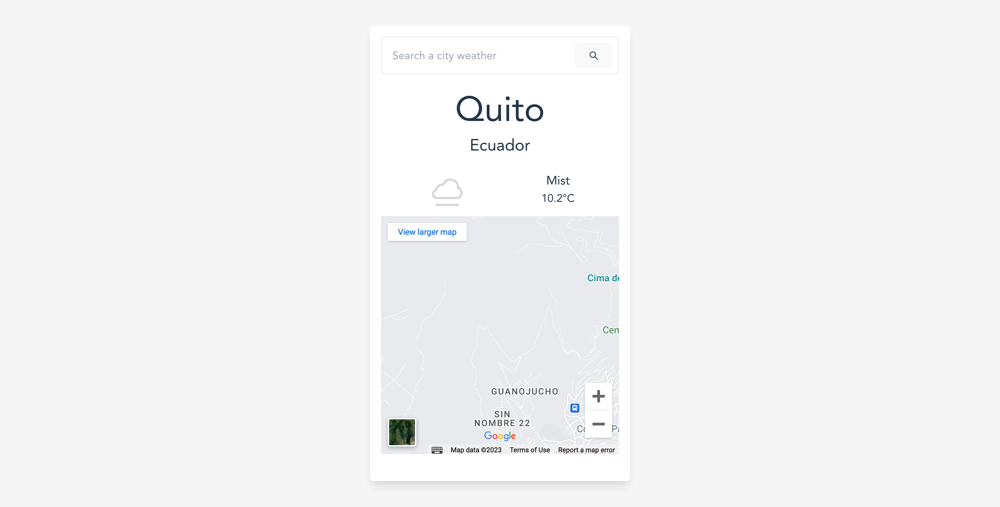

# Kruger Star - Weather app

## Table of contents

- [Overview](#overview)
  - [The challenge](#the-challenge)
  - [Screenshot](#screenshot)
  - [Links](#links)
- [My process](#my-process)
  - [Built with](#built-with)
  - [What I learned](#what-i-learned)
  - [Useful resources](#useful-resources)
- [Author](#author)
- [About Kruger Star](#about-kruger-star)


## Overview

### The challenge

Users should be able to:

- View details about a city's weather
- Search for another city's weather
- View the optimal layout for the interface depending on their device's screen size
- See hover and focus states for all interactive elements on the page

### Screenshot




### Links

- Live Site URL: [click here](https://weather-widget-five.vercel.app)

## My process

### Built with

- Semantic HTML5 markup
- CSS custom properties
- Flexbox
- CSS Grid
- [React](https://reactjs.org/) - JS library
- [Tailwind CSS](https://tailwindcss.com) - For styles
- [Vite](https://vitejs.dev)- Frotend tooling


### What I learned

How to import env variables in Vite. In order to do it, you have to use something like this:

```js
const url = import.meta.env.VITE_API_URL
```

Always use use meta object, because inside it are store env variables.

### Useful resources
[Env Variables and Modes](https://vitejs.dev/guide/env-and-mode.html) - This helped me for use and declare env variables using Vite. This information is important if you're using it, because it always depend how the bundler or tool has predefine acces to env variables. 


## Author

- Website - [Edwin Cacuango](https://edwinc.dev)
- Twitter - [@edwincacuango](https://www.twitter.com/edwincacuango)


## About Kruger Star

Kruger Star is a reality created and funding by Kruger Corporation. It help future developers to become fullstack developers, mean while they teach you about front and backend languages and tools. 
This project is a delivery part of Kruger Star initiative. For more information, visit the oficial site [here](https://ktalks.krugercorp.com/es/kruger-star-2022)
